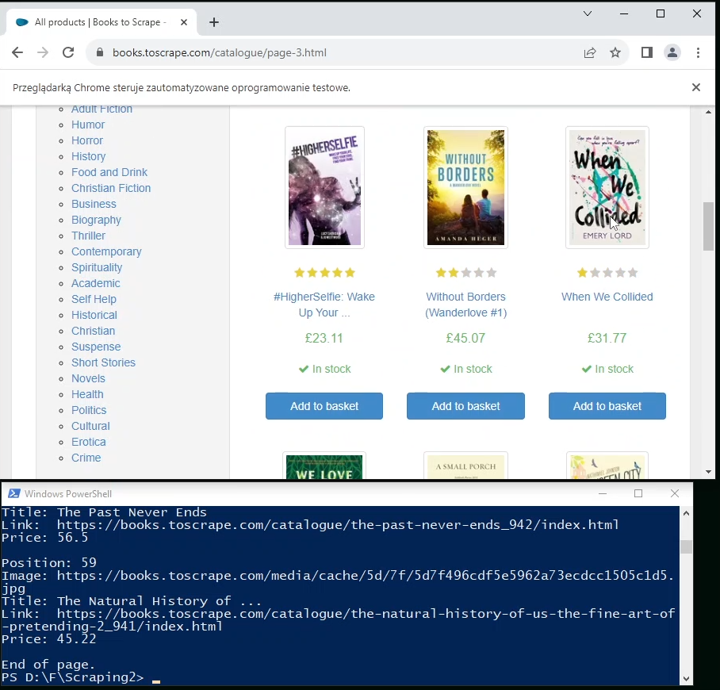
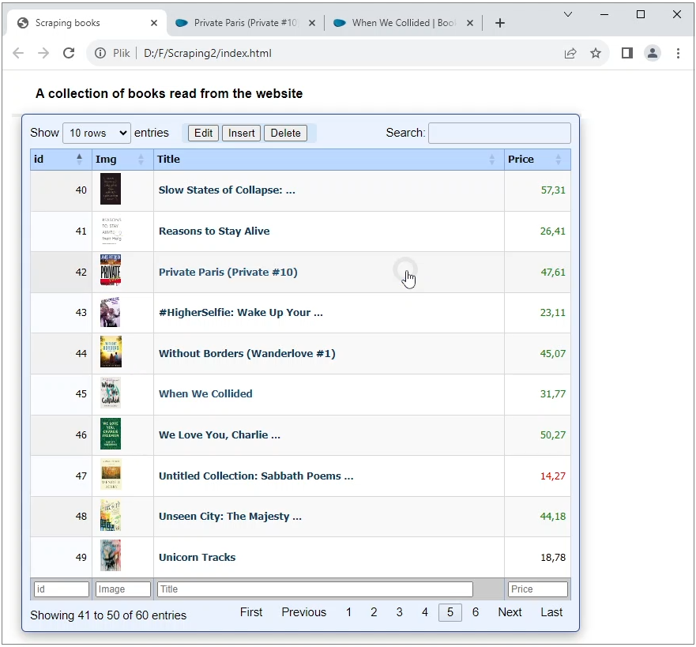

# Advanced Node scraping application

A Node scraping application for advanced reading data from websites

## Web Scraping
Often, websites containing interesting data do not provide data via the API mechanism, but publish this data as text on the website. There is a problem in downloading such data and the scraping technique is used to retrieve it.
Web scraping is the process of extracting data from a specific web page. It involves making an HTTP request to a website’s server, downloading the page’s HTML and parsing it to extract the desired data

.

## How the application works
This application presents downloading data about books from an online store that does not provide data via API. The Node.js technology uses the popular Selenium scraping library. 
The procedure loads the original page into the browser, then parses the content of the HTML tags and extracts the data.
Data is often presented on many subpages. This app after reading a page loads the next one and can save all the data.

.

.

